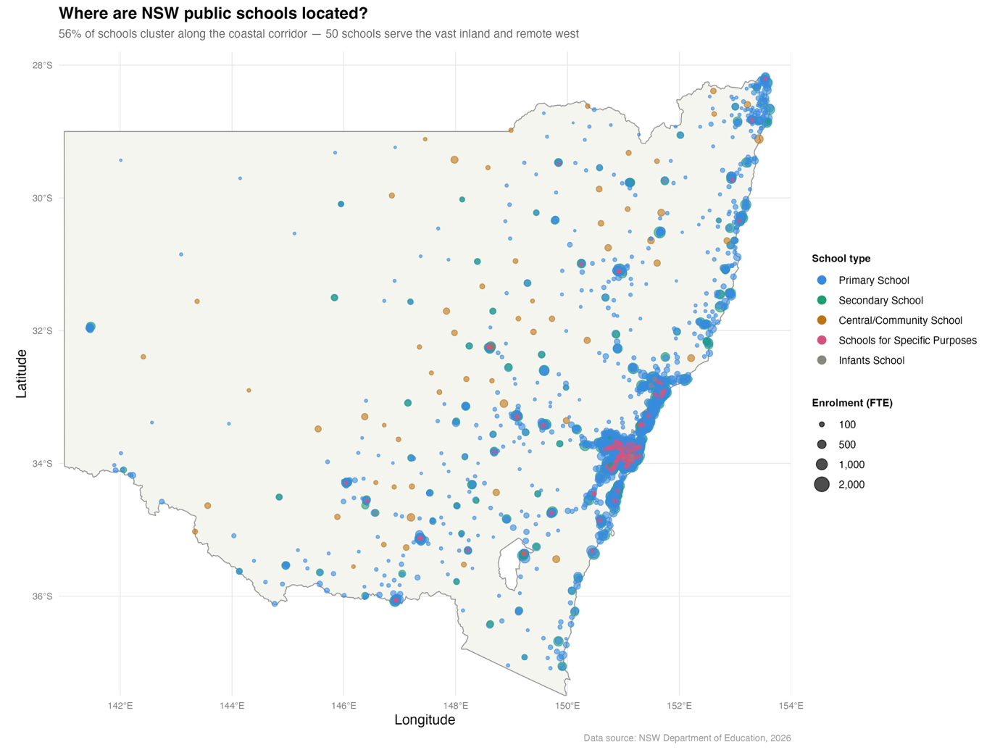
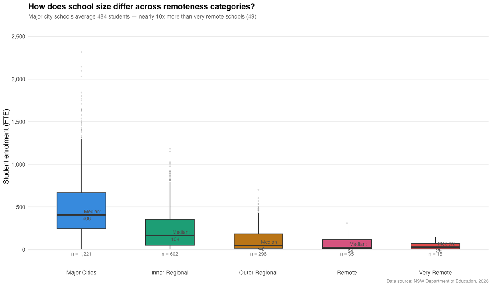
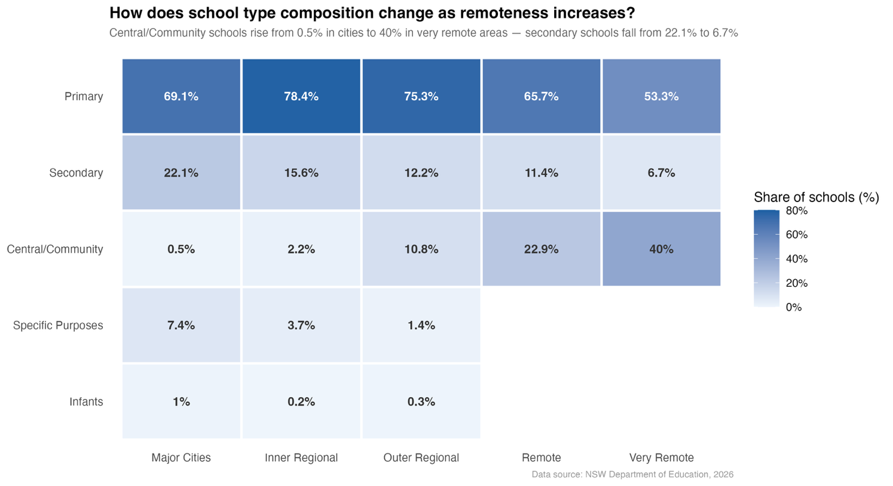
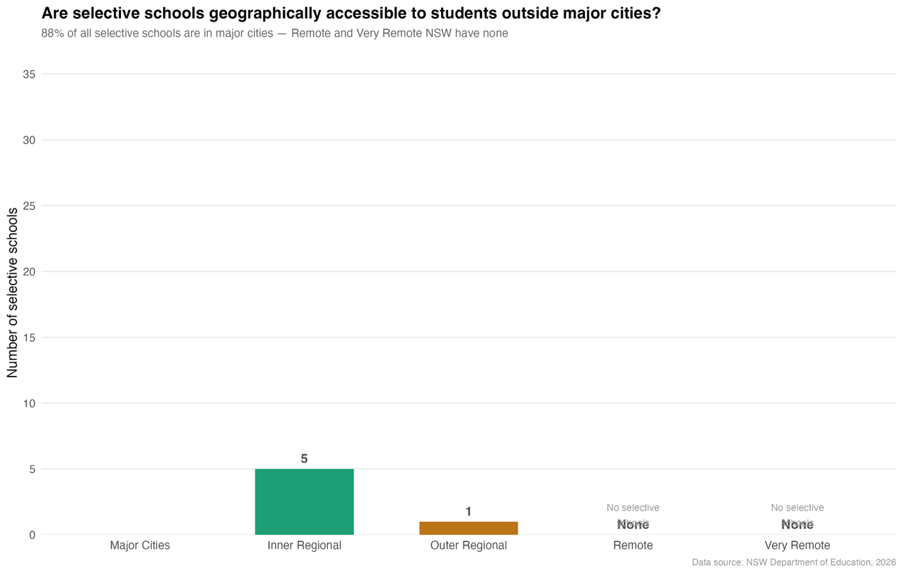
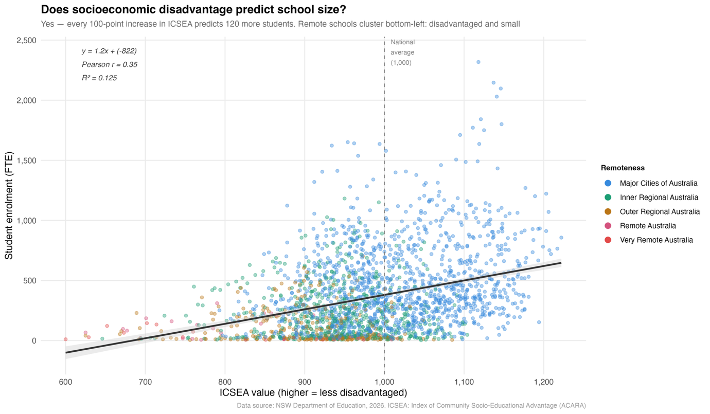

# How Does Geography Shape Educational Inequality in NSW Public Schools?

An end-to-end data analysis and visualisation project using NSW Government open data. I cleaned the dataset in Python, built five visualisations in R, and wrote up what they show about how location affects school size, school type, access to selective schools and socioeconomic disadvantage.

**Tools:** Python 3 (pandas, JupyterLab) · R (ggplot2)
**Data:** [NSW Government School Locations and Student Enrolment Numbers](https://data.nsw.gov.au), NSW Department of Education via Data NSW. 2,210 schools, 46 variables.

---

## Key findings

- **Schools follow the population.** Schools are heavily concentrated along the coast. Only 50 schools serve the entire remote and very remote west of the state.
- **Remote schools are much smaller.** The median enrolment is 57 students in very remote areas, compared with 310 in major cities.
- **School types change with distance.** Combined K–12 Central/Community schools go from 0.5% of schools in major cities to 40% in very remote areas, because small populations can't support separate primary and secondary schools.
- **Selective schools are concentrated in cities.** 90% of NSW's 48 selective schools are in major cities, and outer regional and remote areas have none.
- **Disadvantage and remoteness overlap.** Remote schools combine low ICSEA scores with small enrolments, averaging 243 ICSEA points below metropolitan schools.

---

## Visualisations

### 1. Where are NSW public schools located?


### 2. How does school size differ by remoteness?


### 3. How does the mix of school types change with remoteness?


### 4. Can students outside major cities reach a selective school?


### 5. Does socioeconomic disadvantage predict school size?


---

## Data cleaning (Python)

- Removed 14 of 46 columns: contact fields, an entirely blank column, outdated electorate boundaries and fields not relevant to the analysis.
- Converted 7 numeric columns stored as text to numbers using `pd.to_numeric(errors='coerce')`.
- **Respected privacy suppression.** Values coded "np" in `Indigenous_pct` and `LBOTE_pct` were kept as missing rather than filled in, in line with the Department's policy of protecting students in small communities.
- Filled missing categorical values with "Unknown". Kept genuine missing numeric values, such as enrolment (41) and ICSEA (51), as missing.
- Ran IQR-based outlier checks and confirmed the flagged values as genuine. For example, Lord Howe Island Central School has an off-mainland longitude.
- Found no duplicate records.

## Design and ethics choices

- **Showed full distributions, not just averages.** Box plots show the full spread of enrolments, so the picture isn't oversimplified.
- **Showed uncertainty.** The regression line includes a confidence interval.
- **Used standard classifications.** Remoteness follows the ABS Australian Statistical Geography Standard (ASGS), so comparisons are objective and reproducible.

---

## Repository structure

```
├── images/      # The five charts
└── README.md
```

The Python cleaning notebook and R script will be added soon.

---

*Nouviboth Ra · [LinkedIn](https://www.linkedin.com/in/nouviboth-ra-792439362)*
